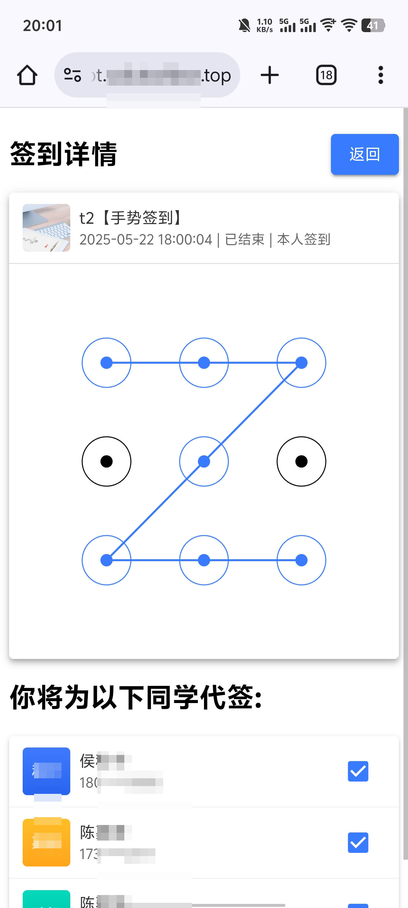
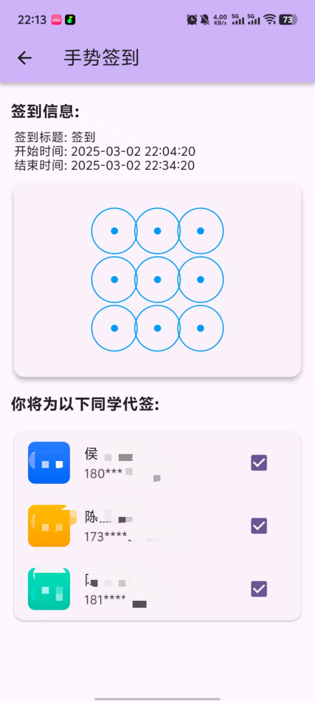
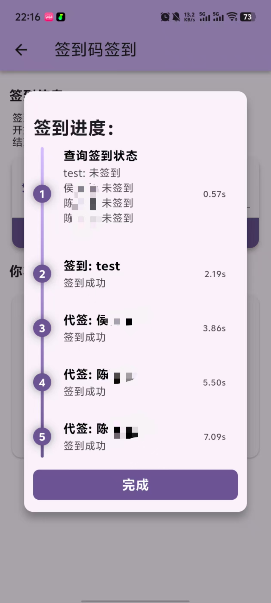

<center><div align="center">

</img>
# 学不通
### 一人签到，全寝睡觉
</div></center>


## 软件功能
- 只需1人即可代签n人, 帮助同使用本软件的同班同学签到
- 可选的代签生效课程, 自动识别同班同学
- 支持签到码/二维码/手势/位置(可自选)/普通签到
- 支持绕过签到滑块人机验证码
- 用户白名单机制(需手动在UserPerm添加)
- 提供 `Web前端版本` 以及 `Flutter客户端` 版本

## 技术栈
- 前端: Vue, Vite, Pinia, Vue Router, Varlet, JS & TS
- 客户端: Flutter, Dart, Dio
- 后端: Python, Flask, Mysql

## 实机截屏 - Web
| **签到主页** | **选课配置页** | **用户设置页** | **登录页** |
|:---:|:---:|:---:|:---:|
|<div align="center"> |<div align="center"> |<div align="center"> |<div align="center"> |
| **普通签到** | **手势签到** | **位置签到** | **签到码签到** |
|<div align="center"> |<div align="center"> |<div align="center"> |<div align="center"> |
| **二维码签到** | **签到结果页** |
|<div align="center"> |<div align="center"> |

## 实机截屏 - Android
| **签到主页** | **选课配置页** | **用户设置页** | **登录页** |
|:---:|:---:|:---:|:---:|
|<div align="center"> |<div align="center"> |<div align="center"> |<div align="center"> |
| **普通签到** | **手势签到** | **位置签到** | **签到码签到** |
|<div align="center"> |<div align="center"> |<div align="center"> |<div align="center"> |
| **二维码签到** | **签到结果页** |
|<div align="center"> |<div align="center"> |

## 交流反馈
喜欢本项目的话，求点亮Star🙏
- [QQ群: 250369908](https://qm.qq.com/cgi-bin/qm/qr?k=yxbcu6vNZm3JvJElnCRHGbMgmNOADF6H&jump_from=webapi&authKey=+4fa+h7XTvKdeECaauj7wEFLOhVAkrtFNUh0VMcC3bP8eAeUqiXwctprZJOFHfkh)
- [Telegram: XueBT](https://t.me/XueBT)


## 食用方法
> 本教程稍有难度，**需一定的计算机基础**，如抱着“下载直接用”, “网上找个资源圈钱”的心态阅读此说明，可以洗洗睡了。

### 开始前准备
部署使用本项目需有：
- 公网IP的云服务器
- 解析向服务器的域名（中国大陆需先备案）
- SSL证书(Web调用摄像头API扫码必须要开启Https)

### 公私钥生成
因涉及到账号密码网络传输，开始前需先生成自己的公私钥对

- 首先你的电脑中需要安装好Python环境
- 安装pycryptodome库 `pip install pycryptodome`
- 运行 `/Tools/genKey.py` 自动生成公私钥对
- 生成好的公钥位于 `Client/assets/keys/public.pem`, `Server/keys/public.pem` 和 `Web/public/keys/public.pem` 中
- 生成好的私钥位于 `Server/keys/private.pem` 中
- 检查它们是否成功生成，并妥善保管私钥，以防泄漏

---

### 前端部署
客户端相关文件均在 `/Web` 文件夹下

#### 修改配置
客户端配置文件在 `src/config.example.js` 中，复制(Duplicate)一份并重命名为 `config.js` 使用按照注释与预设的格式修改即可。

#### config.example.js
```
// 软件版本号
export const config_version = "1.1.0";

// 后端地址
export const config_baseURL = "https://api.xbt.example.com";

// 签到预设位置，经纬度可以从https://api.map.baidu.com/lbsapi/getpoint/获取
// description为教师端显示的位置信息，可以自己在学习通创建班级作为教师账号，发布位置签到->选择位置界面查看
// name为客户端位置缩写，可自行命名
export const config_locationPreset = [
  {"name": "一号教学楼", "lng": '104.195155', "lat": '30.654549', "description": "成都市龙泉驿区XA03成都大学-第一教学楼"},
  {"name": "二号教学楼", "lng": '104.195676', "lat": '30.655039', "description": "四川省成都市龙泉驿区成洛大道2025号成都大学-第二教学楼"},
  {"name": "三号教学楼", "lng": '104.196078', "lat": '30.655429', "description": "四川省成都市龙泉驿区成洛大道2025号成都大学-第三教学楼"},
  {"name": "四号教学楼", "lng": '104.196734', "lat": '30.656081', "description": "四川省成都市龙泉驿区成洛大道2025号成都大学-第四教学楼"},
  {"name": "五号教学楼", "lng": '104.197228', "lat": '30.656462', "description": "四川省成都市龙泉驿区成洛大道2025号成都大学-第五教学楼"},
  {"name": "六号教学楼", "lng": '104.197875', "lat": '30.656959', "description": "四川省成都市龙泉驿区成洛大道2025号成都大学-第六教学楼"},
  {"name": "七号教学楼", "lng": '104.198023', "lat": '30.655774', "description": "成都市龙泉驿区致远路成都大学第七教学楼"},
  {"name": "八号教学楼", "lng": '104.198719', "lat": '30.659048', "description": "四川省成都市龙泉驿区成洛大道2025号成都大学-第八教学楼"},
  {"name": "九号教学楼", "lng": '104.198724', "lat": '30.661448', "description": "四川省成都市龙泉驿区十陵上街1号成都大学-第九教学楼"},
  {"name": "十号教学楼", "lng": '104.20096', "lat": '30.662395', "description": "四川省成都市龙泉驿区成洛大道2025号成都大学-第10教学楼"},
  {"name": "十一号教学楼", "lng": '104.203835', "lat": '30.661696', "description": "成都市龙泉驿区锦城北路成都大学成都大学11号教学楼"},
  {"name": "十二号教学楼", "lng": '104.204001', "lat": '30.661094', "description": "成都市龙泉驿区锦城北路成都大学成都大学-12号教学楼"},
  {"name": "十三号教学楼", "lng": '104.205932', "lat": '30.661044', "description": "四川省成都市龙泉驿区十陵街道成都大学-北区成都大学13号教学楼"},
  {"name": "十四号教学楼", "lng": '104.206233', "lat": '30.661611', "description": "四川省成都市龙泉驿区西河街道成都大学-北区成都大学14号教学楼"},
  {"name": "十五号教学楼", "lng": '104.20459', "lat": '30.663545', "description": "四川省成都市龙泉驿区十陵街道友谊东路大运村室外篮球场"},
  {"name": "十六号教学楼", "lng": '104.206206', "lat": '30.663366', "description": "四川省成都市龙泉驿区成洛大道2025号成都大学15栋对面成都大学-橙园16舍"},
  {"name": "十七号教学楼", "lng": '104.207141', "lat": '30.663568', "description": "四川省成都市龙泉驿区成洛大道2025号成都大学综合楼成都大学斯特灵学院-阅览室"},
  {"name": "十八号教学楼", "lng": '104.207922', "lat": '30.663389', "description": "四川省成都市龙泉驿区锦城北路成都大学成都大学宿舍-18栋"}
];

```

#### 打包
- 安装依赖 `npm i`
- 本地测试 `npm run dev`
- 打包dist `npm run build`

---

### 客户端部署
客户端相关文件均在 `/Client` 文件夹下

#### 修改配置
客户端配置文件在 `lib/config.example.dart` 中，复制(Duplicate)一份并重命名为 `config.dart` 使用按照注释与预设的格式修改即可。

#### config.example.dart
```
// 软件版本号
String version = "1.1.0";

// 后端地址
String config_baseURL = "https://api.xbt.example.com";

// 签到预设位置，经纬度可以从https://api.map.baidu.com/lbsapi/getpoint/获取(百度坐标系)
// description为教师端显示的位置信息，可以自己在学习通创建班级作为教师账号，发布位置签到->选择位置界面查看
// name为客户端位置缩写，可自行命名
List<Map<String, dynamic>> config_locationPreset = [
  {"name": "一号教学楼", "lng": '104.195155', "lat": '30.654549', "description": "成都市龙泉驿区XA03成都大学-第一教学楼"},
  {"name": "二号教学楼", "lng": '104.195676', "lat": '30.655039', "description": "四川省成都市龙泉驿区成洛大道2025号成都大学-第二教学楼"},
  {"name": "三号教学楼", "lng": '104.196078', "lat": '30.655429', "description": "四川省成都市龙泉驿区成洛大道2025号成都大学-第三教学楼"},
  {"name": "四号教学楼", "lng": '104.196734', "lat": '30.656081', "description": "四川省成都市龙泉驿区成洛大道2025号成都大学-第四教学楼"},
  {"name": "五号教学楼", "lng": '104.197228', "lat": '30.656462', "description": "四川省成都市龙泉驿区成洛大道2025号成都大学-第五教学楼"},
  {"name": "六号教学楼", "lng": '104.197875', "lat": '30.656959', "description": "四川省成都市龙泉驿区成洛大道2025号成都大学-第六教学楼"},
  {"name": "七号教学楼", "lng": '104.198023', "lat": '30.655774', "description": "成都市龙泉驿区致远路成都大学第七教学楼"},
  {"name": "八号教学楼", "lng": '104.198719', "lat": '30.659048', "description": "四川省成都市龙泉驿区成洛大道2025号成都大学-第八教学楼"},
  {"name": "九号教学楼", "lng": '104.198724', "lat": '30.661448', "description": "四川省成都市龙泉驿区十陵上街1号成都大学-第九教学楼"},
  {"name": "十号教学楼", "lng": '104.20096', "lat": '30.662395', "description": "四川省成都市龙泉驿区成洛大道2025号成都大学-第10教学楼"},
  {"name": "十一号教学楼", "lng": '104.203835', "lat": '30.661696', "description": "成都市龙泉驿区锦城北路成都大学成都大学11号教学楼"},
  {"name": "十二号教学楼", "lng": '104.204001', "lat": '30.661094', "description": "成都市龙泉驿区锦城北路成都大学成都大学-12号教学楼"},
  {"name": "十三号教学楼", "lng": '104.205932', "lat": '30.661044', "description": "四川省成都市龙泉驿区十陵街道成都大学-北区成都大学13号教学楼"},
  {"name": "十四号教学楼", "lng": '104.206233', "lat": '30.661611', "description": "四川省成都市龙泉驿区西河街道成都大学-北区成都大学14号教学楼"},
  {"name": "十五号教学楼", "lng": '104.20459', "lat": '30.663545', "description": "四川省成都市龙泉驿区十陵街道友谊东路大运村室外篮球场"},
  {"name": "十六号教学楼", "lng": '104.206206', "lat": '30.663366', "description": "四川省成都市龙泉驿区成洛大道2025号成都大学15栋对面成都大学-橙园16舍"},
  {"name": "十七号教学楼", "lng": '104.207141', "lat": '30.663568', "description": "四川省成都市龙泉驿区成洛大道2025号成都大学综合楼成都大学斯特灵学院-阅览室"},
  {"name": "十八号教学楼", "lng": '104.207922', "lat": '30.663389', "description": "四川省成都市龙泉驿区锦城北路成都大学成都大学宿舍-18栋"}
];

```

#### 打包
- `flutter build apk --release` 打包安卓客户端

---

### 后端部署
后端相关文件均在 `/Server` 文件夹下

#### Mysql 初始化
> 注：Mysql中的 `UserPerm` 表为用户权限表，目前作用仅为实现白名单，你需要给每个需要使用本项目的同学添加进白名单，把Ta的手机号填入 `mobile` 字段，然后将 `permission` 字段设为1即可。

Mysql 初始化文件在 `Server/xbt.sql` 中，在你的Mysql中创建一个名为xbt(你自己命名也可以，后端配置文件中可以配置)的库并运行此文件。

#### xbt.sql
```
SET NAMES utf8mb4;
SET FOREIGN_KEY_CHECKS = 0;

-- ----------------------------
-- Table structure for CourseInfo
-- ----------------------------
DROP TABLE IF EXISTS `CourseInfo`;
CREATE TABLE `CourseInfo` (
  `classId` bigint NOT NULL,
  `courseId` bigint NOT NULL,
  `name` varchar(255) CHARACTER SET utf8mb4 COLLATE utf8mb4_0900_ai_ci NOT NULL,
  `teacher` varchar(255) DEFAULT NULL,
  `icon` varchar(255) CHARACTER SET utf8mb4 COLLATE utf8mb4_0900_ai_ci NOT NULL,
  PRIMARY KEY (`classId`,`courseId`)
) ENGINE=InnoDB DEFAULT CHARSET=utf8mb4 COLLATE=utf8mb4_0900_ai_ci;

-- ----------------------------
-- Table structure for SignInfo
-- ----------------------------
DROP TABLE IF EXISTS `SignInfo`;
CREATE TABLE `SignInfo` (
  `activeId` bigint NOT NULL,
  `startTime` bigint DEFAULT NULL,
  `endTime` bigint DEFAULT NULL,
  `signType` int DEFAULT NULL,
  `ifRefreshEwm` tinyint DEFAULT NULL,
  PRIMARY KEY (`activeId`)
) ENGINE=InnoDB DEFAULT CHARSET=utf8mb4 COLLATE=utf8mb4_0900_ai_ci;

-- ----------------------------
-- Table structure for SignRecord
-- ----------------------------
DROP TABLE IF EXISTS `SignRecord`;
CREATE TABLE `SignRecord` (
  `uid` bigint NOT NULL,
  `activeId` bigint NOT NULL,
  `source` bigint NOT NULL COMMENT '>0(uid)-1(auto)',
  `signTime` bigint NOT NULL,
  PRIMARY KEY (`uid`,`activeId`)
) ENGINE=InnoDB DEFAULT CHARSET=utf8mb4 COLLATE=utf8mb4_0900_ai_ci;

-- ----------------------------
-- Table structure for UserCourse
-- ----------------------------
DROP TABLE IF EXISTS `UserCourse`;
CREATE TABLE `UserCourse` (
  `uid` bigint NOT NULL,
  `classId` bigint NOT NULL,
  `courseId` bigint NOT NULL,
  `isSelected` tinyint NOT NULL,
  PRIMARY KEY (`uid`,`classId`,`courseId`)
) ENGINE=InnoDB DEFAULT CHARSET=utf8mb4 COLLATE=utf8mb4_0900_ai_ci;

-- ----------------------------
-- Table structure for UserInfo
-- ----------------------------
DROP TABLE IF EXISTS `UserInfo`;
CREATE TABLE `UserInfo` (
  `uid` bigint NOT NULL COMMENT 'userId',
  `name` varchar(255) DEFAULT NULL,
  `mobile` varchar(255) DEFAULT NULL,
  `token` varchar(255) CHARACTER SET utf8mb4 COLLATE utf8mb4_0900_ai_ci DEFAULT NULL,
  `avatar` varchar(255) DEFAULT NULL,
  PRIMARY KEY (`uid`),
  UNIQUE KEY `mobile` (`mobile`)
) ENGINE=InnoDB DEFAULT CHARSET=utf8mb4 COLLATE=utf8mb4_0900_ai_ci;

-- ----------------------------
-- Table structure for UserPerm
-- ----------------------------
DROP TABLE IF EXISTS `UserPerm`;
CREATE TABLE `UserPerm` (
  `mobile` bigint NOT NULL,
  `permission` tinyint DEFAULT NULL,
  PRIMARY KEY (`mobile`)
) ENGINE=InnoDB DEFAULT CHARSET=utf8mb4 COLLATE=utf8mb4_0900_ai_ci;

SET FOREIGN_KEY_CHECKS = 1;

```

#### 安装依赖
在 `/Server` 中打开终端，运行 `pip install -r requirements.txt` 安装后端依赖

#### requirements.txt
```
beautifulsoup4
cryptography
DBUtils
ddddocr
Flask
pycryptodome
pyexecjs
PyMySQL
pyquery
Requests

```

#### 修改配置
后端配置文件在 `mysql.example.json` 中，复制(Duplicate)一份并重命名为 `mysql.json` 使用按照注释与预设的格式修改即可。

#### mysql.example.json
```
{
  "host": "example.com",
  "port": 3306,
  "user": "root",
  "passwd": "114514",
  "db": "xbt",
  "charset": "utf8mb4",
  "maxconnections": 8
}
```

#### 运行
使用 `python ./index.py` 即可运行，服务将开放于3030端口

#### 跨域反代
由于Python后端并没有进行CORS相关配置，需反代解决（以Nginx为例）
```conf
# HTTP 到 HTTPS 重定向
server {
    listen 80;
    # 替换为你的域名
    server_name api.xbt.example.com;
    return 301 https://$host$request_uri;
}

# API 后端配置
server {
    listen 443 ssl;
    # 替换为你的域名
    server_name api.xbt.example.com;

    # SSL 证书路径（需替换为实际路径）
    ssl_certificate /home/ubuntu/Nginx/keys/api.crt;
    ssl_certificate_key /home/ubuntu/Nginx/keys/api.key;

    # 可选的 SSL 配置优化
    ssl_protocols TLSv1.2 TLSv1.3;
    ssl_prefer_server_ciphers on;
    ssl_ciphers EECDH+AESGCM:EDH+AESGCM:AES256+EECDH:AES256+EDH;

    location / {
        proxy_pass http://localhost:3030;
        proxy_set_header Host $host;
        proxy_set_header X-Real-IP $remote_addr;
        proxy_set_header X-Forwarded-For $proxy_add_x_forwarded_for;
        proxy_set_header X-Forwarded-Proto $scheme;
        fastcgi_buffers 256 128k;
        chunked_transfer_encoding off;
        # python没有处理跨域问题，这里反代处理, 添加 CORS 头
        add_header 'Access-Control-Allow-Origin' '*' always;
        add_header 'Access-Control-Allow-Methods' 'GET, POST, OPTIONS, PUT, DELETE' always;
        add_header 'Access-Control-Allow-Headers' 'DNT,User-Agent,X-Requested-With,If-Modified-Since,Cache-Control,Content-Type,Range,Token,Version' always;

        # 处理 OPTIONS 预检请求
        if ($request_method = 'OPTIONS') {
            add_header 'Access-Control-Allow-Origin' '*' always;
            add_header 'Access-Control-Allow-Methods' 'GET, POST, OPTIONS, PUT, DELETE' always;
            add_header 'Access-Control-Allow-Headers' 'DNT,User-Agent,X-Requested-With,If-Modified-Since,Cache-Control,Content-Type,Range,Token,Version' always;
            add_header 'Content-Length' 0;
            return 204;
        }
    }
}
```

---

## 免责声明
本项目仅作为交流学习使用，通过本项目加深网络通信、接口编写、交互设计等方面知识的理解，请勿用作商业用途，任何人或组织使用项目中代码进行的任何违法行为与本人无关。如有触及相关平台规定或者权益，烦请联系我删除。         

## 开源协议

本软件遵循 `GPLv3` 开源协议，以下为该协议内容解读摘要:

* 可自由复制 你可以将软件复制到你的电脑，你客户的电脑，或者任何地方。复制份数没有任何限制
* 可自由分发 在你的网站提供下载，拷贝到U盘送人，或者将源代码打印出来从窗户扔出去（环保起见，请别这样做）。
* 可以用来盈利 你可以在分发软件的时候收费，但你必须在收费前向你的客户提供该软件的 GNU GPL 许可协议，以便让他们知道，他们可以从别的渠道免费得到这份软件，以及你收费的理由。
* 可自由修改 如果你想添加或删除某个功能，没问题，如果你想在别的项目中使用部分代码，也没问题，唯一的要求是，使用了这段代码的项目也必须使用 GPL 协议。
* 如果有人和接收者签了合同性质的东西，并提供责任承诺，则授权人和作者不受此责任连带。